#Chapter1 计算机系统概论

[TOC]

##纲要：

- 计算机系统简介
- 计算机系统基本组成
- 计算机硬件主要技术指标

## 1.1 计算机系统简介

Q1:现代计算机由哪几部分组成？(顶层抽象)

A:软件 + 硬件。本课程主要讲硬件的设计逻辑。硬件提供接口，软件通过接口指令控制硬件。

软件分层：

- 底层：系统软件 (操作系统/编译器/服务型软件) 
- 上层：应用软件

###==系统复杂性管理方法==：

- 1、抽象（abstract）：隐藏系统中不重要的细节
- 2、层次化(Hierachy) ：将要设计的系统划分为多个模块或子模块，分别对模块设计
- 3、模块化(Modularity)：有明确定义(well-defined)的功能与接口
- 4、规则性(regularity)：模块更容易被重用

从程序员角度来分层：高级语言—>汇编语言—>操作系统—>机器语言—>微指令系统

##1.2 计算机的基本组成

###一、冯诺依曼计算机特点

- 五大部分组成(**运算器、控制器、存储器**、输入、输出) (是不是一定需要这五个部件？)
- **指令和数据以同等地位存于存储器**，可按址寻访
- 指令和数据都是二进制表示(为什么用二进制？换成别的进制不可以吗？)
- **指令由操作码与地址码组成**
- ==存储程序==(核心特征，存储结构的计算机)
- **以运算器为中心**

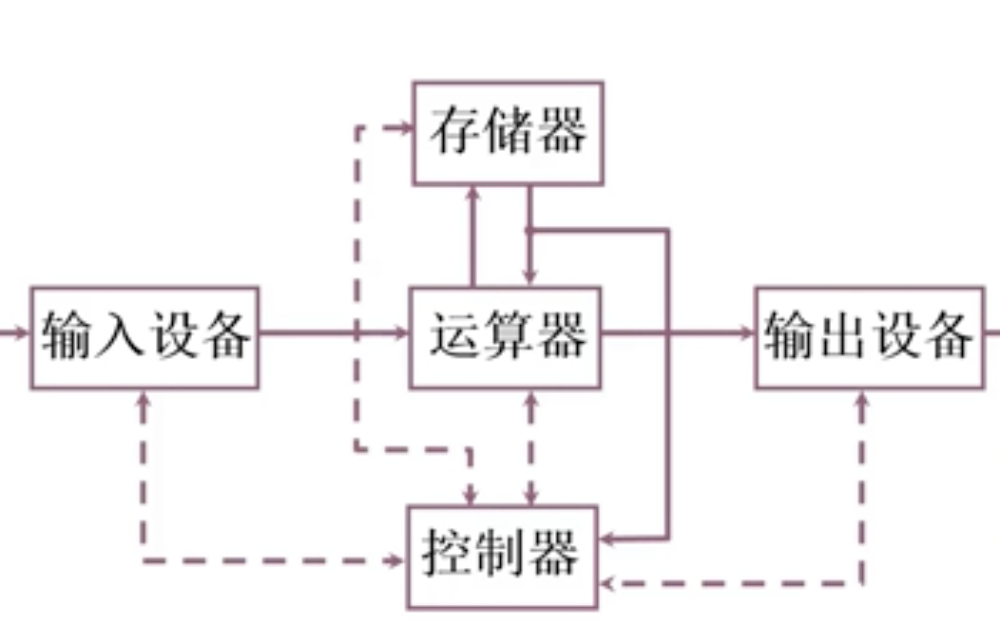

其结构的问题：==以运算器为核心==，运算器成为性能的瓶颈；不具有层次化特征

###二、计算机硬件框图

改进：

- ==以存储器为中心==的计算机硬件框图
- 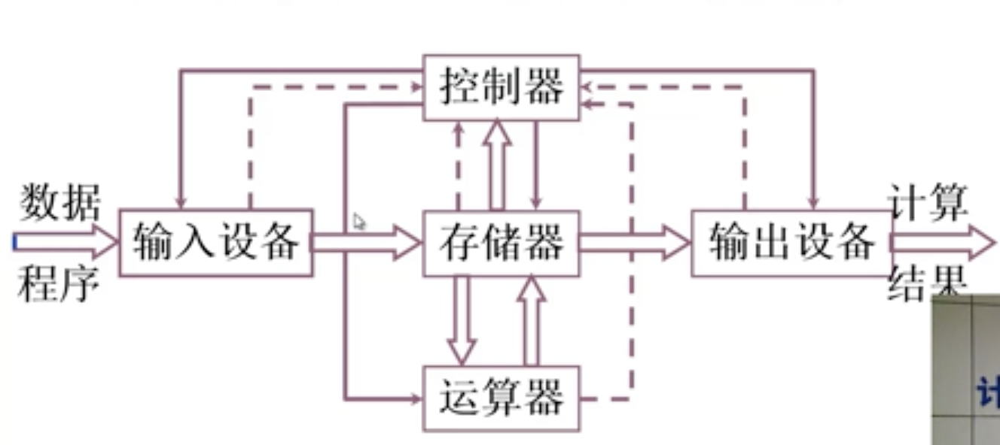

- 层次化划分：

注：主存+CPU构成主机；辅存和输入输出设备构成I/O系统

将图中每个部分进一步细化，再重新组装起来就构成了计算机组成系统。(层次化+模块化)

思考：真正的运算器、控制器、存储器结构都是什么样的？(这正是本课程要学习的)

Q:一个现实中的问题，如何用计算机来解决？

Q:是不是所有的问题都可以用计算的方法来解决？(可计算性理论/算法理论)(e.g.图灵机停机问题)

假设我们面对的是一个可计算问题，如何解决一个问题呢？

###三、计算机工作步骤

我们设定一个可计算的问题，来对计算机组成框图的各个部件进行细化。

####1、上机前的准备

- 建立数学模型
- 确定计算方法
- 编制解题程序
  - 程序：运算的全部步骤
  - 指令：每一个步骤

- 编程举例：

  - 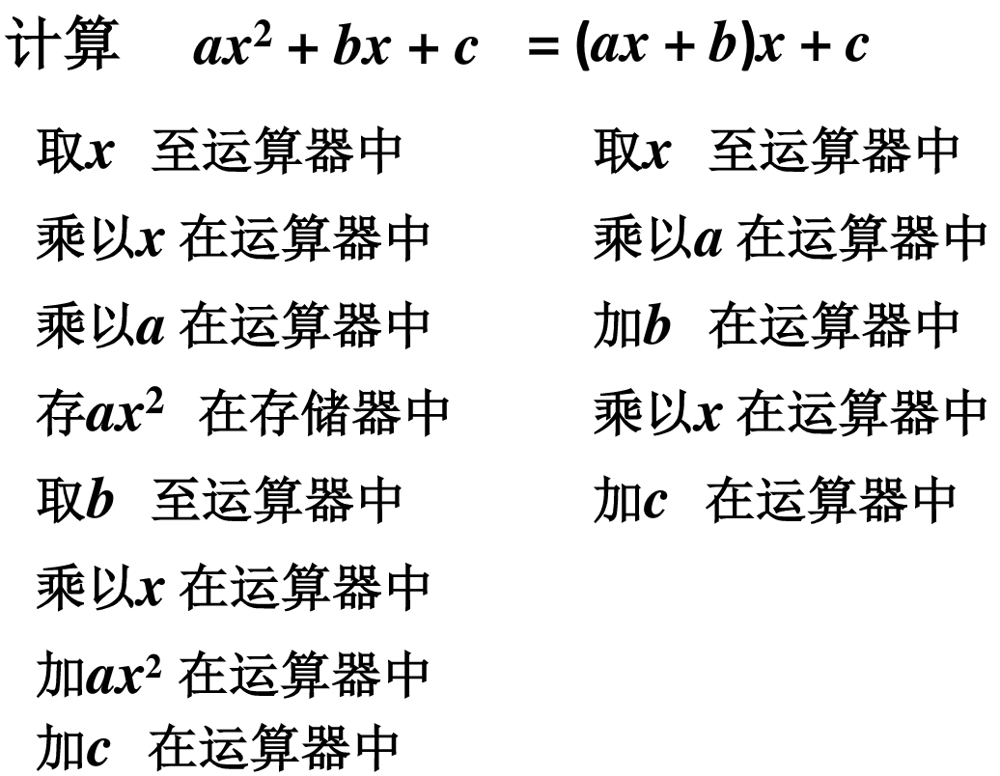
  - 可以看出上面两种算法，前一种有一些将计算结果保存到存储器中的步骤，后者全都在运算器中进行运算。
  - 把上面的步骤用指令的方式表示：
    - 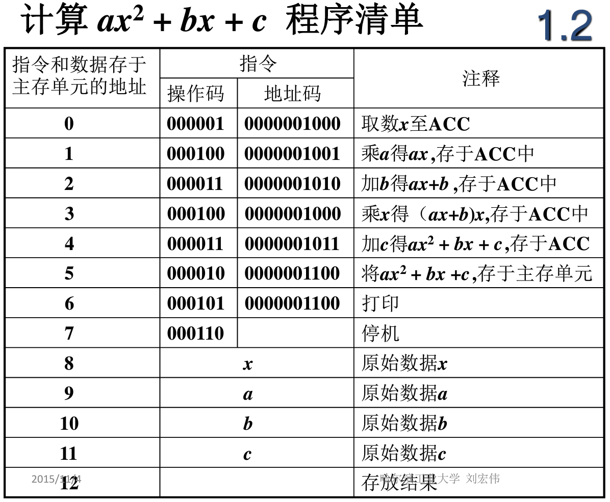

  前8个地址保存的是指令，后5个地址保存的是数据；每一条指令都由操作码和地址码组成；其中注意乘法部分，将乘法的结果存放到ACC中，可能存在溢出的问题，如何解决呢？

指令和数据保存在存储器中，所以存储器是什么样的？如何访问呢？每次访问获得的数据的位数是多少呢？我们先从存储器的结构来看。

####2、计算机的解题过程

#####2.1存储器的基本组成 <!--很重要-->

类比：

- 存储体 — 存储单元 — 存储原件(0/1)
- 大楼    —  房间        — 床位 (有人/没人)

重要概念：

- ==存储单元== ：存放一串二进制代码(可能是指令，也可能是数据)
- ==存储字== ： 存储单元中二进制代码的组合
- ==存储字长==：存储单元中二进制代码的位数(32位/64位)

每个存储单元赋予一个地址号，每个存储单元中存放一个存储字；存储单元按地址寻访

- ==MAR==(Memory Address Register)存储器地址寄存器：存每一个存储单元的地址，反映存储单元的个数

- ==MDR==(Memory Data Regester)存储器数据寄存器：存数据的，反映存储字长

  设MAR=4位  说明存储单元个数是2的4次方=16个（反映存储单元的个数）;

   MDR=8位，说明存储字长8位

解释：计算机中的主存数据寄存器(MDR)，与主存地址寄存器(MAR)帮助完成CPU和主存储器之间的通信：

- MAR用来保存数据被传输到的位置的地址或者数据来源位置的==地址==；

- MDR保存要被写入地址单元或者从地址单元读出的==数据==。

#####2.2 运算器的基本结构及操作过程<!--很重要-->

运算器的功能是什么，如何工作？

- 加法运算
- 乘法运算
- 或与非

运算器结构：

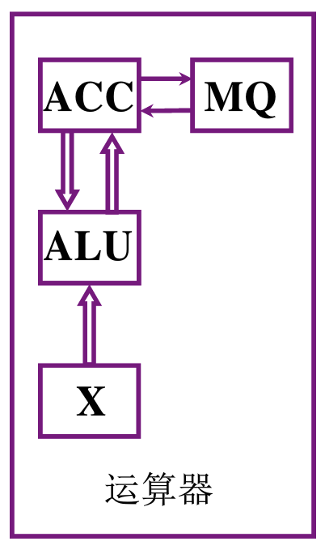

- **ALU**（**Arithmetic Logic Unit**）：算数逻辑单元，核心运算单元；通常是个组合电路，其特点是如果输入撤销，那么输出结果也会撤销，所以如果要保存结果需要在输入输出端加上相应的寄存器（ACC，X）；
- **ACC**（Accumulator）：累加器；
- **X**： 数据寄存器；
- **MQ**：乘商寄存器（在乘法过程中，产生的结果是操作数的两倍）为了把乘法结果都保存下来，需要此寄存乘法增加的部分；

|      |      ACC       |          MQ          |   X    |
| :--: | :------------: | :------------------: | :----: |
| 加法 |   被加数、和   |                      |  加数  |
| 减法 |   被减数、差   |                      |  减数  |
| 乘法 | 乘法结果的高位 | 乘数、乘法结果的低位 | 被乘数 |
| 除法 |  被除数、余数  |          商          |  除数  |
|      |                |                      |        |

乘法：加法+移位操作 (<u>这里有点不太清楚</u>)

除法：减法+移位操作 (<u>这里有点不太清楚</u>)

==(回去看看《编码》、《CSAPP》第二章理解理解，再回过来看看)==

###### 2.2.1 加法操作

- 首先，要把被加数存到ACC中
- 然后把加数从M存的内存地址中取出，存到X中
- 由ALU计算加法结果，并把结果存到ACC中

###### 2.2.2 减法操作

- 首先把被减数放在ACC中
- 然后，从M中取出减数
- 由ALU执行减法计算，并将计算结果存放到ACC中

#####2.3 控制器的基本结构 <!--很重要-->

运算器中各种操作都是在控制器的控制下执行的。那么控制器的功能是什么，进而其结构应该是什么样的呢？

功能：

- 解释指令
- 保证指令按顺序执行

基本结构：

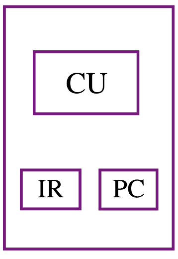

完成一条指令：

- 取指令(PC)
- 分析指令(IR)
- 执行指令(CU) 

结构：

- CU：核心控制单元，执行指令
- PC：程序计数器，用来存放当前要执行==指令的地址==，具有计数功能(PC) + 1 —> PC(不同的机型，这里不一定+1，即相邻两个指令的物理地址不一定相邻)
- IR：指令寄存器，存放当前欲执行的指令

##### 2.4 主机完成一条指令的过程(极其重要！)

**这里要好好理解每一个指令步骤，理解了每一个步骤就相当于理解了这一章。**

(1)主机完成一条取数指令的步骤

取数指令的功能：把存储体(主存/内存)中的数存到ACC中

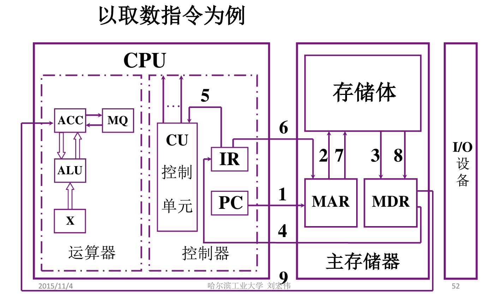

完成一条指令的三个阶段：

1. 取指令
2. 分析指令
3. 执行指令

（注：指令：操作码+地址码）

==取数操作步骤分析==（如图）：

1. 要执行的指令的地址保存在PC中，指令保存在存储体中；第一步将PC中要执行的指令的地址放入MAR;
2. MAR将指令地址送给存储体M；
3. 在控制器的控制下，存储体M将指令地址中的指令送给MDR;
4. 在控制器的控制下，将MDR中的指令存到IR中；(到此，取指令的操作完成；PC—>MAR—>M—>MDR—>IR)
5. 分析指令：将IR中指令的操作码部分给CU，由CU去分析控制执行；
6. 把IR中指令中待取的数的地址部分送到MAR；
7. MAR将数的地址送给存储体M；
8. 在控制器的控制下，存储体M将数的地址中的数送给MDR;
9. 在控制器的控制下，MDR中的数交给ACC保存。

(2)主机完成一条存数操作步骤

存数指令的功能：把存放在ACC中的计算结果存到内存单元M中

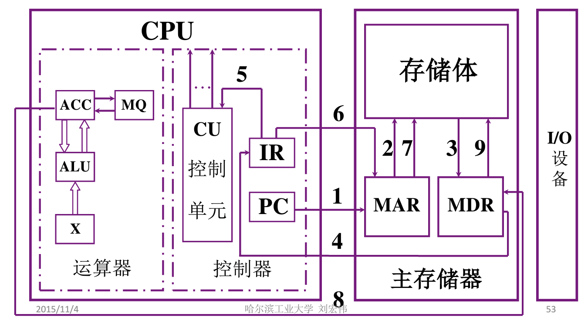

==存数操作步骤分析==（如图）：

1. 要执行的指令的地址保存在PC中，指令保存在存储体中；第一步将PC中要执行的指令的地址放入MAR;
2. MAR将指令地址送给存储体M；
3. 在控制器的控制下，存储体M将指令地址中的指令送给MDR;
4. 在控制器的控制下，将MDR中的指令存到IR中；(到此，取指令的操作完成；PC—>MAR—>M—>MDR—>IR)
5. 分析指令：将IR中指令的操作码部分给CU，由CU去分析控制执行；
6. 把IR中指令中待存的数的地址送到MAR；(从这一步开始不同)
7. MAR将数的地址送给存储体M，告诉存储体要存进来一个数，其地址是多少；
8. 在控制器的控制下，将ACC中要存的数交给MDR;
9. 在控制器的控制下，将MDR中的数交给存储体。

存取数指令已经分析完了，那么加法、乘法、停机、打印等指令在这个模型下怎么执行？(自行思考)

#####2.5 程序在计算机上如何执行<!--很重要-->

一条指令的执行步骤我们已经知道了，那么一条程序(多条指令的指令集)的执行步骤就是把一条条指令按顺序执行；

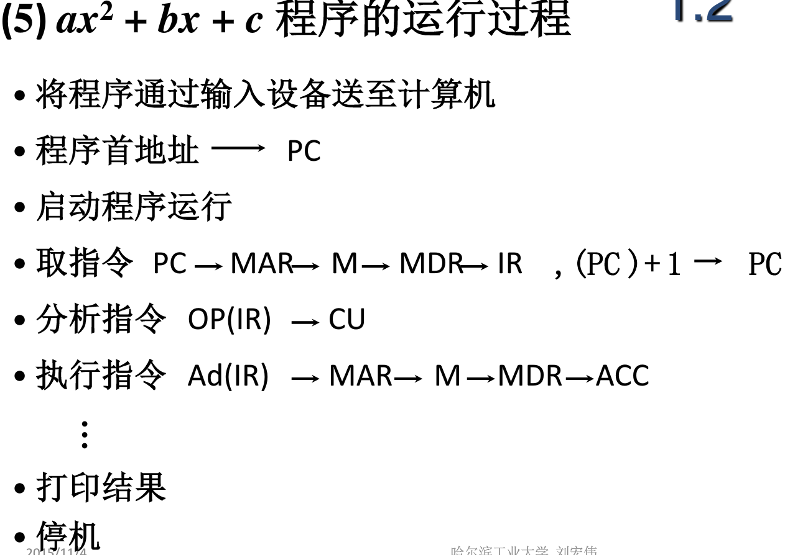

这里同样只是分析了取指令的步骤，任何一条指令都可以分为三步执行：取指令—>分析指令—>执行指令。注意PC执行完一条指令之后，就可以+1了，指向下一条指令的地址。

##1.3 计算机硬件指标

###一.机器字长

CPU一次能处理数据的位数（如可以对两个8位二进制数进行加法，就是8位），与CPU中的寄存器（ACC,X,MQ）的位数有关。

一般来说，机器字长越长性能越好。

###二.运算速度

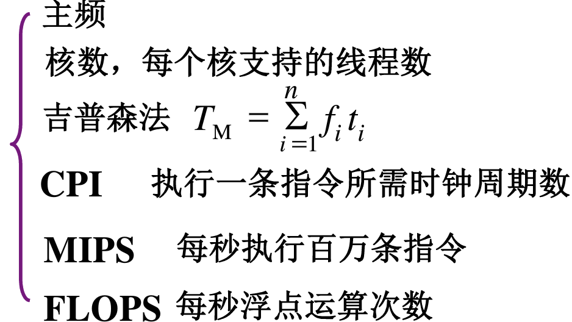

前两个是硬件指标；后四个是从指令执行的角度来衡量的。

###三.存储容量

存放二进制信息的总位数

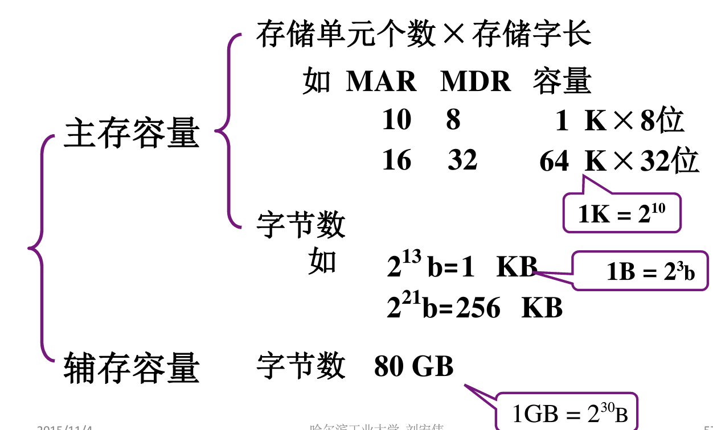

##1.4 总结

- 首先，本课程介绍的是硬件的组成逻辑。介绍了4种复杂系统的管理方法：抽象、层次化、模块化、规则化等。
- 然后，本章介绍了一条程序的指令（分为操作码和地址码）到底是在主机中怎样执行的，我觉得这部分对我来说很重要，我大概了解了计算机关于程序或指令执行的重要结构：运算器、存储器、控制器，并且了解他们如何工作的。
- 最后，介绍了计算机的硬件指标，其实也就是分别对应于CPU结构和存储器结构，简单了解一下。

