[TOC]

------

#Chapter3 系统总线

------

## 3.1 总线的基本概念

Q：**为什么要用总线**？

A：分散连接：如果把设备（CPU，IO，存储设备）两两联结，那么需要极多的线，且很难扩展，不易于增减外设；所以需要总线。总线和接口是主机与外部设备间传送数据的"大动脉"。

Q：**什么是总线**？

A：==总线（bus）是连接各个部件的信息公共传输线，是各个部件共享的传输介质==。

​	总线是一组能为多个部件**分时共享**的公共信息传送线路（物理导线）。

- **共享**是指总线上可以挂接多个部件，各个部件之间互相交换的信息都可以通过这组线路分时共享。
- **分时**是指**同一时刻只允许有一个部件向总线发送信息**，如果系统中油多个部件，则他们只能分时地向总线发送信息。

### ==1、总线上的信息传送方式：==

- 串行：一条车道

- 并行：多条车道

  传输距离：串行方式能够传输较长的距离，节省布线空间；并行的方式，线与线之间会存在信号干扰，但是传送的速度快，适合短距离传送。

  传输速度：串行更快；并行存在很多问题。

  - 问题一：时序传播的同步问题
  - 问题二：并行线之间的信号干扰问题

  > 由于并行传送方式的前提是用**同一时序传播信号，用同一时序接收信号**，而过分提升时钟频率将难以让数据传送的时序与时钟合拍，布线长度稍有差异，数据就会以与时钟不同的时序送达，另外，提升时钟频率还容易**引起信号线间的相互干扰**，导致传输错误。因此，并行方式难以实现高速化。从制造成本的角度来说，增加位宽无疑会导致主板和扩充板上的布线数目随之增加，成本随之攀升。 

### ==2、总线结构的计算机举例==

(1)单总线结构

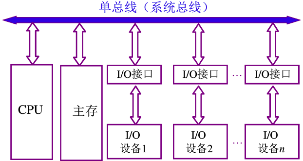

​	单总线结构，任意两个设备之间进行信号传输时阻塞了总线，其他设备不能使用该总线，比如主存和IO设备进行信号传输时，CPU和主存就没法传输信号。总线成为了系统瓶颈。

(2)面向CPU的双总线结构

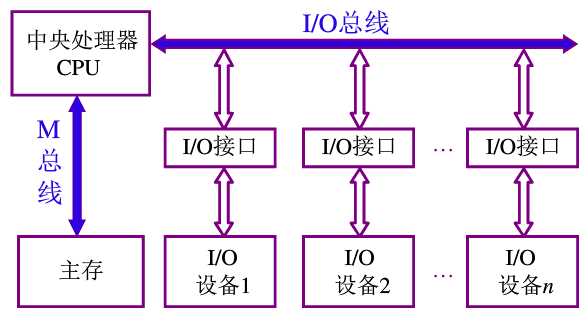

​	以CPU为核心，给CPU和主存之间单独接一条总线，方便了CPU和主存的信息传输（CPU和主存的通信非常频繁，必须单独设个总线，这样不会被别的设备阻塞，通信速度更快），但是主存和IO设备的信息传输要以CPU为媒介，如果主存和IO设备进行信息交换，那么CPU需要停止一段时间，这也不好。

(3)以存储器为中心的双总线结构

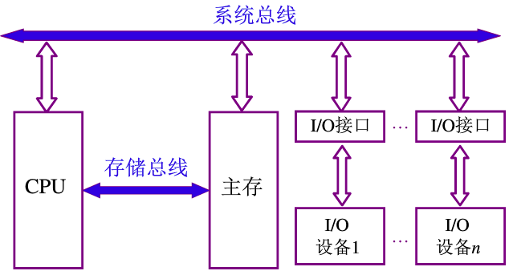

​	以存储器为中心，一个系统总线和一个存储总线：**系统总线**解决主存和IO，CPU和IO之间的信息交换；CPU和主存之间的信息交换较频繁，单独加一根**存储总线**。但是目前的技术，系统总线和存储总线也不能同时传输，也就是说主存没法同时既和IO传输又和CPU传输，依然用的分时的方法。

------

##3.2 总线分类

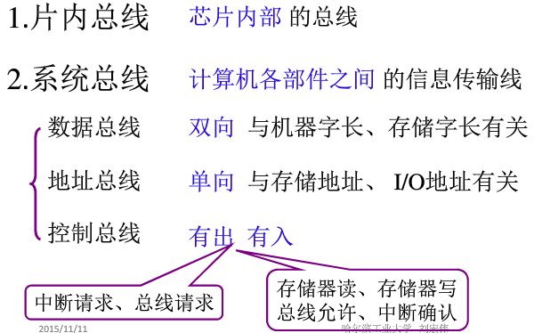

- 数据总线(DB)：传输各个部件之间的数据信息，包括指令和操作数；位数(根数)与机器字长、存储字长有关；双向传输。
- 地址总线(AB)：传输地址信息，包括主存单元或I/O端口的地址；位数(根数)与主存地址空间大小及设备数量有关；单向。
- 控制总线(CB)：一个控制线传输一个信号；有出：CPU送出的控制命令；有入：主存(或外设)返回CPU的反馈信号。

按时序控制方式：

- 同步总线
- 异步总线

------

##3.3 总线特性和性能指标

###1、总线的物理实现

​	总线刻在主板上，并且留出设备接口。

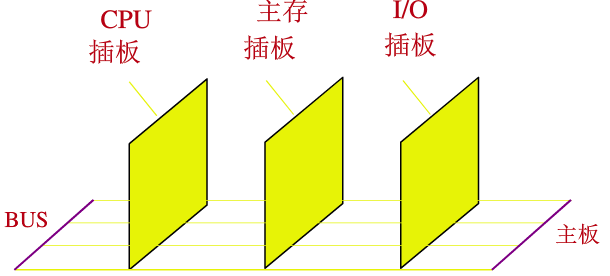

###2、总线特性

- 机械特性：尺寸、形状、管脚数、排列顺序
- 电气特性：传输方向和有效的电平范围
- 功能特性：每跟传输线的功能：
  - 地址信号传输
  - 数据信号传输
  - 控制信号传输
- 时间特性：信号的时序关系

###3、总线的性能指标

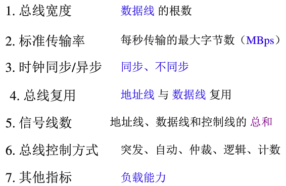

###4、总线标准

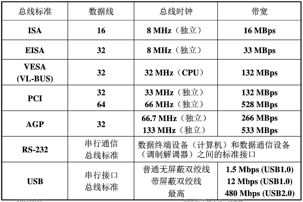

------

ISA是一种古老的总线标准，是并行总线，速度慢。

后来改进采用PCI总线，带宽和时钟频率都上升了，但依然是并行总线。

现在大多数都是PCIe总线标准，比如PCIe1,PCIe2,PCIe3以及最近的PCIe4，他们的传输速度是一代比一代快。

PCI1e的传输速度可以达到250MB/s,而PCIe4是它的4倍，也就是2GB/s。

现在CPU和南桥的DMA总线一般就是PCIe3，或者最新的PCIe4.

参考：【硬件科普】PCIe到底是个什么东西？他在电脑里是干什么<https://www.bilibili.com/video/av66250574?t=667>

##3.4 总线结构

###1、单总线结构

​	上面说过，就是把CPU、主存、IO设备（通过I/O接口）用一组总线连在一起，允许I/O之间、I/O与主存之间直接信息交换。

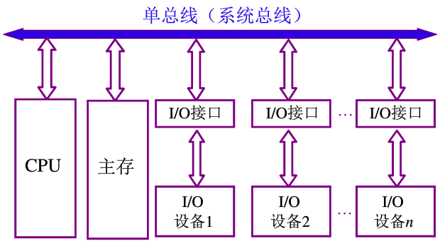

​	优点：结构简单，成本低，易于扩展

​	缺点：带宽低，负载重，多个部件只能争用唯一的总线，容易形成计算机系统的瓶颈，且不支持并发传送操作

###2、多总线结构

(1)双总线结构

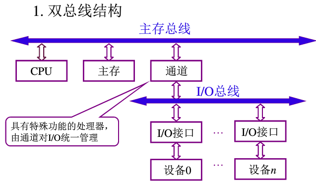

理解：通道类似于南桥，统一处理I/O和其他设备的数据传输。

结构：主存总线，用于CPU、主存和通道之间进行数据传送；I/O总线，用于多个设备与通道之间进行数据传送。通道是具有特殊功能的处理器，能对I/O设备进行统一管理。这样做是把低速的I/O设备从单总线上分离出来。

**通道**是一个具有特殊功能的处理器，CPU将部分功能下方给通道，使其对I/O设备具有统一管理功能。通道有自己的指令，由操作系统编写，其程序放在主存中。

优点：将低速的I/O设备从单总线上分离出来，实现存储器总线和I/O总线分离。

(2)三总线结构

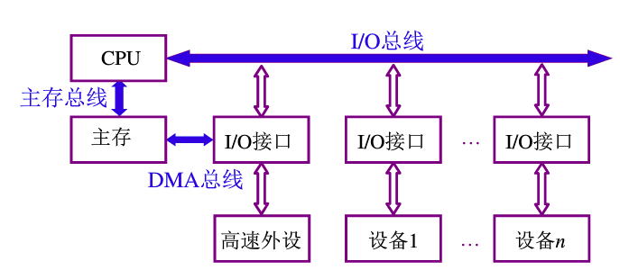

​	这里加了一条DMA(Direct memory access 直接存储器访问)总线，用于主存和高速设备的信息交换。

​	优点：提高了I/O设备的性能，使其更快地响应命令，提高吞吐量。

​	缺点：

​		系统工作效率较低。

​		主存总线与DMA总线不能同时对主存进行存取。

(3)三总线结构的又一形式

​	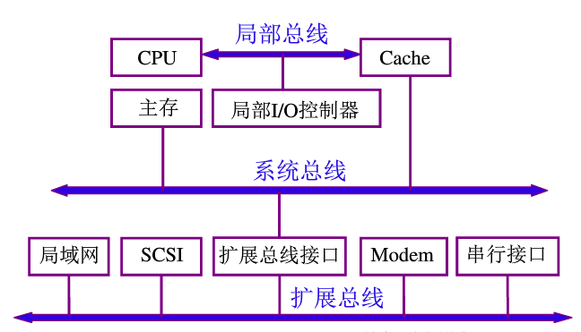

​	这里在CPU和主存之间加了一层Cache，因为CPU速度太快，所以加一些缓存（小容量，高速度）。这里扩展总线上高速设备和低速设备没有分开，可能导致一些设备速度提不上来。

(4)四总线结构

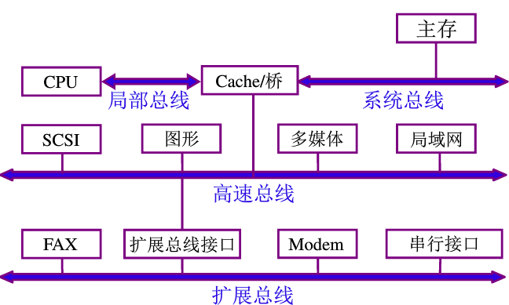

​	这里主要把高速设备和低速设备进行了分层。

​	这里的Cache/桥的作用是 统一处理主存和其他设备的数据传输。

###3、总线结构举例

(1) 传统微型机总线结构

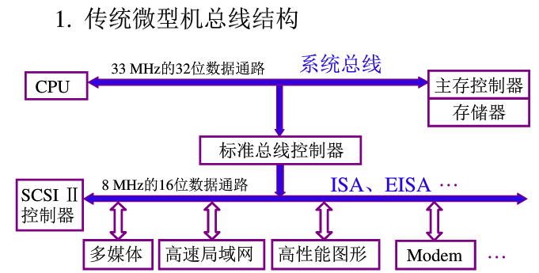

(2) VL-BUS局部总线结构

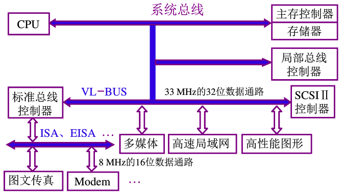

VL-BUS总线是高速总线，ISA，EISA是低速总线，通过标准总线控制器扩展

(3) PCI总线结构

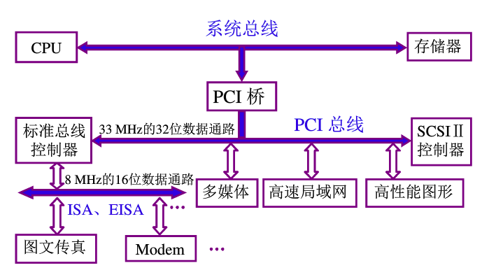

PCI总线是高速总线

(4) 多层PCI总线结构

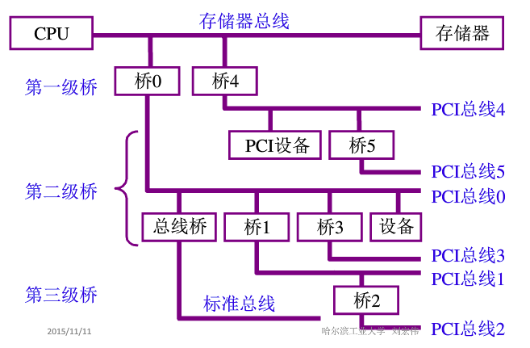

##3.5 ==总线控制(重点/难点)==

### 0、总线完成一次传输的4个阶段

- 申请分配阶段：有需要使用总线的主设备提出申请，经总线仲裁机构决定将下一传输周期的总线使用权授予某一使用者
- 寻址阶段：取得使用权的主设备，通过总线发出本次打算访问的从设备的存储地址或设备地址有关的命令，启动参与本次传输的从设备
- 传数阶段：主设备和从设备进行数据交换
- 结束阶段：从总线上撤除有关信息，让出使用权

### 1、总线判优控制

##### 什么是总线判优控制？

- 多个设备同时向总线发出占用总线请求，那么哪个设备可以使用总线呢？

##### 基本概念

- 主设备(模块) ：对总线有控制权
- 从设备(模块) ：响应从主设备发来的总线命令
- 总线判优控制：
  - ==集中式==
    - ==链式查询==
    - ==计数器定时查询==
    - ==独立请求方式==
  - 分布式(很少，不讲)

#### 1.1 链式查询方式

**基本组件**

- 总线控制部件

- 数据总线：用于数据的传输

- 地址总线：主设备占用总线之后，要和从设备通信，则需要通过地址总线找到从设备

- BS：如果某一个设备占用了总线，就通过这个总线通知其他设备和总线控制部件，总线已经被占用了。

**判优方式**

首先由I/O设备发出占用请求到BR(总线请求)，然后总线控制部件开始在BG线上对接口进行遍历，看每个I/O接口是否发出了占用总线的请求，直到遇到一个I/O接口发出了BR请求，那么久给这个接口占用的权限，让他一个发送BS信号。

- I/O设备的优先级决定了BG查询顺序，如果某个设备的优先级很低，则有可能一直得不到占用权

**缺点**

- BG线如果出故障，则后面的接口无法得到总线使用权了，这种结构对故障非常敏感
- 速度慢，因为要遍历查询接口，而链路优先级传播存在延迟，这种延迟与模块数成正比

**优点**

- 方便扩展
- 结构简单

**应用**

- 一般用在微型计算机和简单的嵌入式系统中。

#### 1.2 计数器定时查询方式

**基本组件**

- 设备地址

**判优方式**

同样的，首先I/O接口向BR线发出占用请求，总线控制部件接受到请求后，向设备地址线发送计数器的值，首先发送计数0，看I/O接口0是否发出占用请求，如果没有，则计数器+1，继续向设备地址线发送计数1，看I/O设备1是否发出占用请求，如果发送了，则让I/O接口1发送数据，并且向BS线发送占用的信息，阻塞其他设备。

**优点**

- 优先级次序比较灵活，比如可以从I/O接口0开始，也可以从任意的I/O接口序号开始，因而可以通过设置计数器初始值的方式比较灵活地决定优先级。

**缺点**

- 速度慢

#### 1.3 独立请求方式

**基本组件**

排队器：提供某种判定设备优先级的方式的设备。判定优先级的方法，可以是预定设定优先级，也可以是自适应的（哪些在使用的过程中比较重要，就那个设备优先级高），也可以是用计数器的方式。

**判优方式**

首先I/O设备发送请求到自己的BR线，然后由总线控制部件里的排队器判定优先级，将占用权通过BG线给最高优先级的设备。其他设备继续排队。

**缺点**

使用的线的数量是2n条，n代表设备数，需要的线多。

**优点**

判定速度快，不再需要一个一个遍历。

### 2、总线通信控制

- 设备占用之后，就可以用总线通信，如何通信能够保证通信的正确性？

通信方式（同步，异步，半同步，）的运行方式，特征和应用场景

异步通信的三种锁运行方式和分别存在的问题，应用场景	