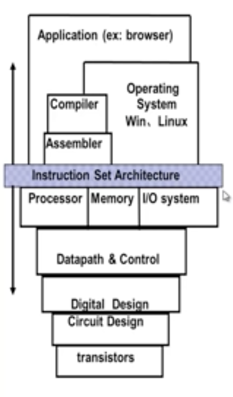
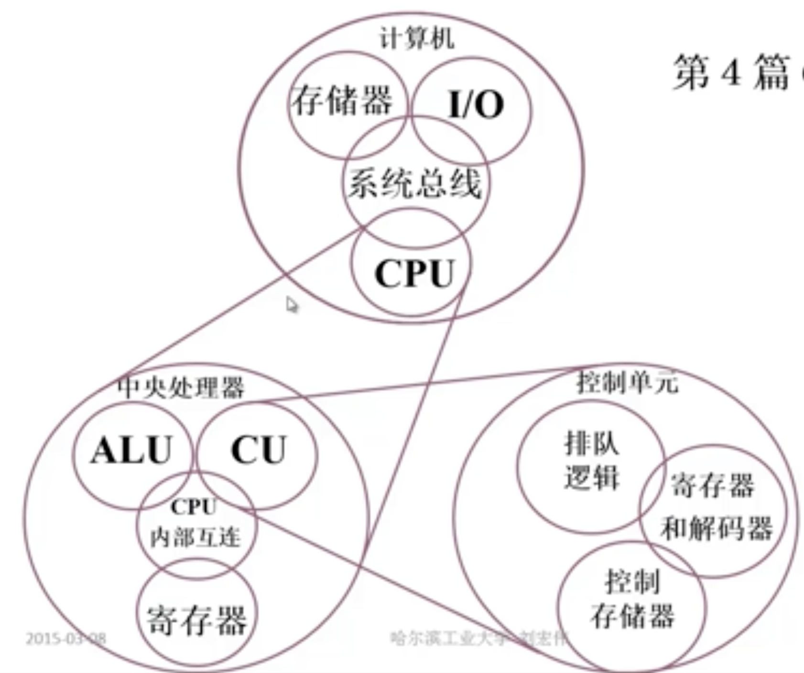

#计算机组成原理绪论

[TOC]

##引：这门课讲什么

计算机：数字电子计算机

组成（origanization）：计算机硬件系统逻辑实现

原理：数字电子计算机硬件系统实现的基本原理

##课程内容

- 基本部件的结构和组织方式
- 基本运算的操作原理
- 基本部件和基本单元的设计思想

##内容组织

- 第一篇：计算机系统概论：计算机系统概貌+程序如何执行
- 第二篇：计算机系统的硬件结构（存储、io、系统总线、CPU）
- 第三篇：CPU(核心：ALU，寄存器，CU)
- 第四篇：CU(排队逻辑，寄存器和解码器，存储器控制)

## 章节组织

- Chapter1：计算机系统概论
- Chapter2：计算机的发展及应用
- Chapter3：系统总线
- Chapter4：存储器
- Chapter5：输入输出系统
- Chapter6：计算机的运算
- Chapter7：指令系统
- Chapter8：CPU的结构
- Chapter9：控制单元的功能
- Chapter10：控制单

##课程分割整合

- 机器篇：
  - 计算机系统基本概念
  - 总线
  - 存储器
  - 输入输出系统
- 数字篇
  - 计算机中数的表示
  - 计算机的运算方式和运算器
- CPU篇
  - 指令系统
  - CPU的结构和功能
  - 控制单元
  - 控制单元的设计

